# KinoVolume: Space-time Video Visualization Lab


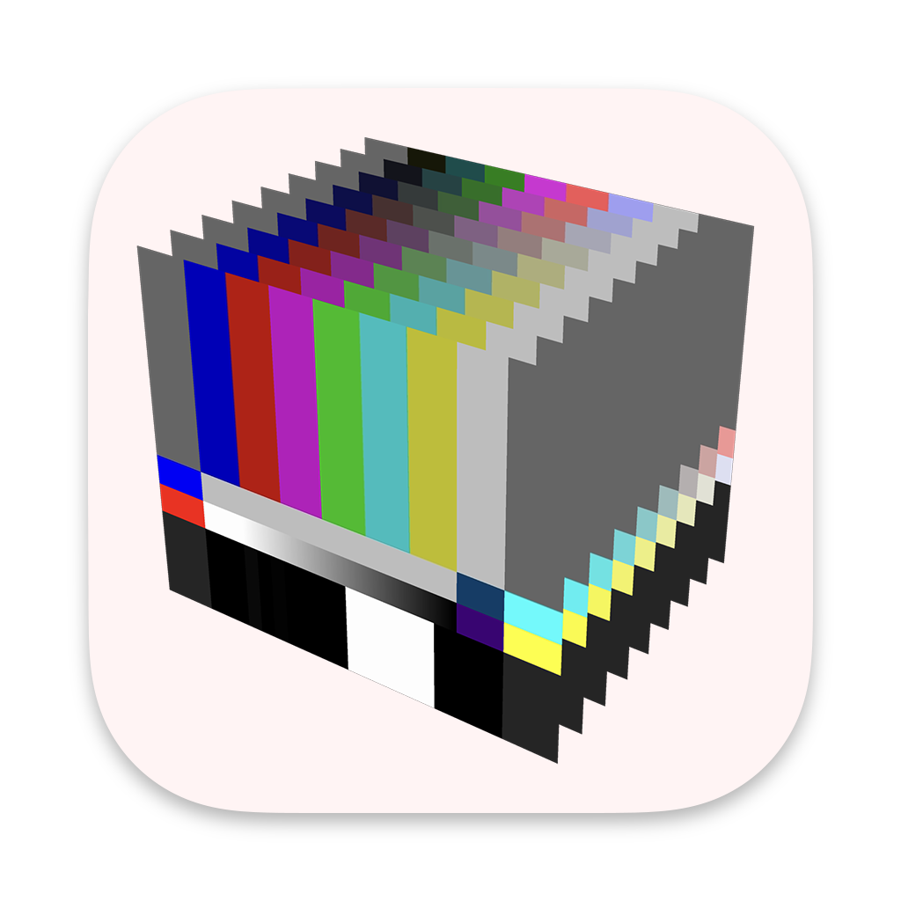

KinoVolume is a desktop tool for turning video into images, 3D forms, and printable models. Instead of treating video only as playback, it lets you work with it as a spatial-temporal volume where time becomes depth.

It is designed for media researchers, artists, designers, and students who want approachable ways to slice, unwrap, fold, compare, and spatialize moving images.

> **Abstract**  
> KinoVolume is research software for transforming video into spatial-temporal images, 3D exports, and printable artifacts. It supports slit-scan, orthogonal slice, cuboid, cylinder, rings, and slit-tear workflows, combining direct frame inspection with interactive 2D and 3D preview. The project is intended for artistic practice, media research, and technical experimentation around time-based image analysis and object-oriented video representation.

**Developed by** Andrés Isaza-Giraldo, researcher at i2ADS in Porto  
**Website** https://isaza.xyz

<!-- Suggested hero asset path: docs/images/interface/hero.gif -->
<!-- Suggested main interface screenshot path: docs/images/interface/main-window.png -->

## Download

> [!NOTE]
> **KinoVolume is available for macOS.** Click the link below to go to the latest release and download the ZIP file.
>
> | Platform | Download |
> | --- | --- |
> | macOS | [⬇ Download latest release](https://github.com/artificialisaza/KinoVolume/releases/latest) |
>
> After downloading: extract the ZIP, move `KinoVolume.app` to your Applications folder, then **right-click → Open** the first time (macOS will show a security warning because the app is not from the App Store — this is normal).

## What it does

KinoVolume treats a video as a block of pixels in space and time:

- `x` and `y` come from the original frame
- time becomes depth
- each mode samples that volume differently

Depending on the workflow, the app can produce:

- Interactive 2D and 3D previews inside the application with screen captures
- 2D images for analysis, presentation, publication, or print
- 3D meshes for Blender and other DCC tools
- Printable PDF unfolds for paper mockups

The current build includes:

- Slice and Orthogonal Slice
- Cuboid Void and Cuboid Fill
- Cylinder
- Rings
- Slit-tear
- Chroma key, edge detection, and AI segmentation inside Cuboid Fill

To do: The app also includes previous/next hard-cut helpers in the frame scrubber. Full shot-detection batch generation is not yet finished.

## At a glance

| You start with | You can make | Good for |
| --- | --- | --- |
| One video file | 2D images, 3D exports, printable PDFs, and in-app previews | media research, artistic experimentation |

## Who this is for

- Media researchers exploring duration, rhythm, repetition, and temporal structure
- Artists translating video into images, objects, meshes, and printables
- Teachers and students working with spatialized moving-image analysis
- Developers and research assistants who need a readable codebase for further experimentation

## Credits and context

- Developed by Andrés Isaza-Giraldo at i2ADS, Porto.
- Parts of the codebase were developed with the aid of coding agents, especially Claude Opus 4.6.

### Interface inspiration

The interface direction and slit-scan workflow were informed by Andrew Ringler's [video-2-slit-scan](https://github.com/andrewringler/video-2-slit-scan).

### Research that shaped this project

KinoVolume draws on a body of work exploring video as a spatial and temporal object:

- **Fels, Sidney, Eric Lee, and Kenji Mase** — *Techniques for Interactive Video Cubism* (2000). One of the foundational papers on treating video as a navigable spatial volume. [https://doi.org/10.1145/354384.354535](https://doi.org/10.1145/354384.354535)
- **Ferguson, Kevin L.** — *Volumetric Cinema* (2015). A video essay exploring what it means to slice and re-spatialize cinematic time. [https://doi.org/10.16995/intransition.11331](https://doi.org/10.16995/intransition.11331)
- **Tang, Anthony, Saul Greenberg, and Sidney Fels** — *Exploring Video Streams Using Slit-Tear Visualizations* (2008). The direct inspiration for the slit-tear mode. [https://doi.org/10.1145/1385569.1385601](https://doi.org/10.1145/1385569.1385601)
- **Kitasenju Design** — *Structure of Slit-scan* (2022). A clear visual explanation of how slit-scan sampling works geometrically. [https://kitasenjudesign.com/slitscan/structure/](https://kitasenjudesign.com/slitscan/structure/)

## Screenshots and output examples

The repository is already prepared for GitHub images. When you want to add screenshots or generated results, place them under `docs/images/` and replace the notes below with actual image embeds.

### Interface

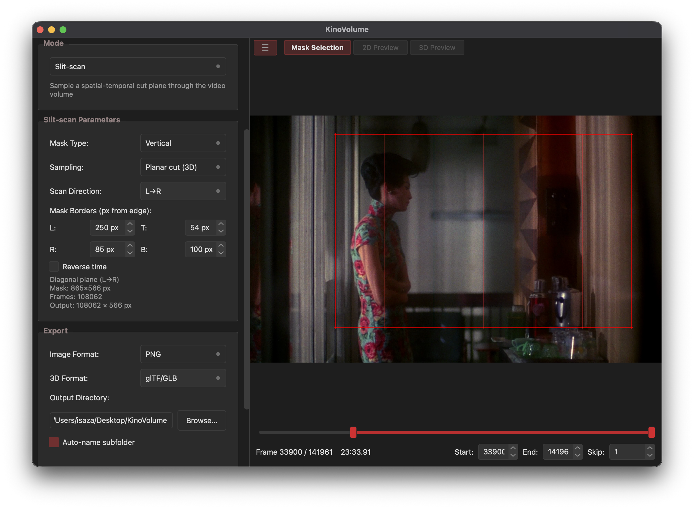
*Mask selector with a frame of the film In The Mood for Love (花樣年華) (2000, Wong Kar-Wai)*

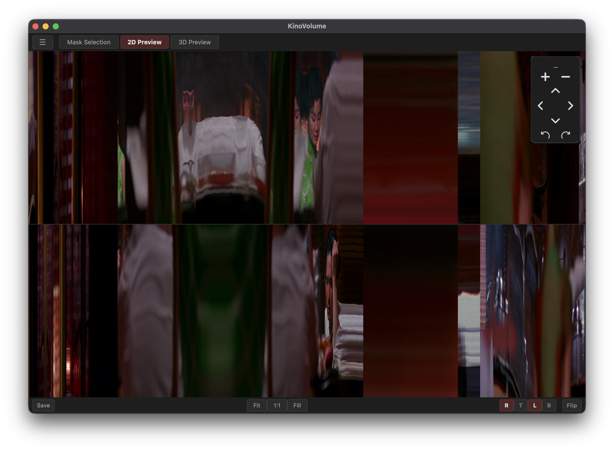
*2D Preview of a cuboid (void) with visualization from the film In The Mood for Love (花樣年華) (2000, Wong Kar-Wai)*

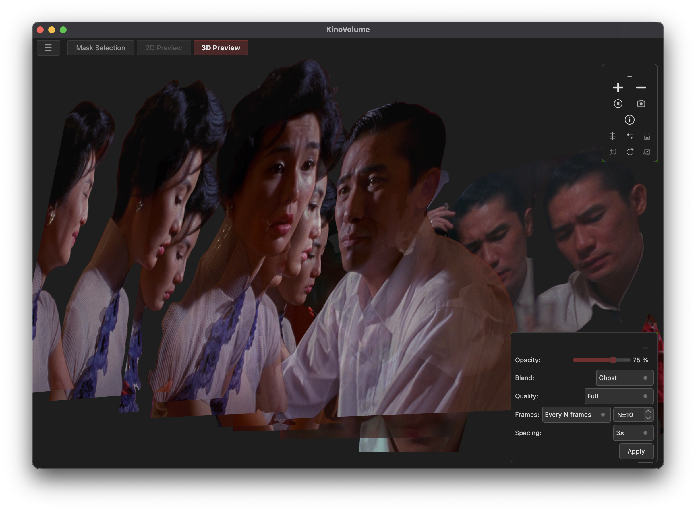
*3D Preview of a cuboid (fill) with visualization from the film In The Mood for Love (花樣年華) (2000, Wong Kar-Wai)*

## Installation

### Requirements

- Python 3.11 or newer
- macOS or Windows
- A video format supported by OpenCV in your environment (`.mp4`, `.avi`, `.mov`, `.mkv`, `.webm`)
- Enough free disk space for exports, especially Cuboid Fill
- Internet access the first time you download an AI segmentation model

### Run from source

```bash
python -m venv .venv
source .venv/bin/activate
python -m pip install --upgrade pip
python -m pip install -e .
python main.py
```

On Windows, activate the environment with:

```bash
.venv\Scripts\activate
```

If you want the test tools as well:

```bash
python -m pip install -e ".[dev]"
```

### macOS: installing a pre-built release

If you received KinoVolume as a DMG or ZIP:

**DMG (recommended)** — double-click the `.dmg` file, then drag `KinoVolume.app` into the `Applications` folder. The first time you open the app, do not double-click it directly. Instead, **right-click** the app and choose **Open**, then click **Open** in the dialog. After this one-time approval, the app opens normally.

**ZIP** — extract the `.zip` file, then move `KinoVolume.app` to your Applications folder. Use the same **right-click → Open** procedure the first time.

> **Why right-click → Open?** KinoVolume is ad-hoc signed (no paid Apple Developer account). macOS Gatekeeper shows an "unidentified developer" warning. Right-click → Open is the correct way to bypass this. Do not run `sudo xattr -cr` — that strips the quarantine but also leaves a broken signature, which can cause other issues.

### macOS build

From the project root, these scripts produce distributable macOS artifacts:

```bash
chmod +x packaging/macos/create_dmg.sh packaging/macos/build_release.sh
```

Build unsigned app + DMG + code-safe ZIP:

```bash
./packaging/macos/build_release.sh
```

The script outputs three artifacts in `dist/`:
- `KinoVolume.app` — the application bundle (ad-hoc signed)
- `KinoVolume-vX.X.dmg` — drag-and-drop installer
- `KinoVolume-vX.X.zip` — code-signature-safe ZIP (uses `ditto`, not plain `zip`)

DMG-only packaging (no rebuild):

```bash
./packaging/macos/create_dmg.sh "dist/KinoVolume.app"
```

## Quick start

1. Click **Open Video** and choose a source clip.
2. Use the frame scrubber to choose the frame range you want to process.
3. Adjust the sampling rate to skip frames when you want a lighter, faster run.
4. Choose a visualization mode from the sidebar.
5. Tune the mode-specific parameters while watching the overlay in the frame preview.
6. Choose the output image format, output directory, and, where available, 3D export format.
7. Click **Generate**.
8. Switch between **Mask Selection**, **2D Preview**, and **3D Preview** after generation.
9. If needed, use **Load Preview...** later to reopen a previously generated output folder.

Useful workflow tip: the frame scrubber includes **Prev Cut** and **Next Cut** helpers for quickly finding likely hard cuts when you want to isolate a shot manually.

If you are new to the app, start with a short frame range and a higher sampling step. It is the easiest way to understand how each mode behaves before running a large export.

## Common controls

| Control | What it does | Why it matters |
| --- | --- | --- |
| Frame range | Sets the first and last processed frame | This is the fastest way to limit export size and processing time |
| Sampling rate | Processes every `N`th frame instead of every frame | The single most important performance control in the app |
| Output directory | Chooses where results are saved | The app can auto-create a timestamped subfolder for each run |
| Image format | `PNG` or `TIFF` | PNG is usually the best default; TIFF is useful for archival or print workflows |
| Preview buttons | Toggle between mask, 2D result, and 3D result | Helps you validate settings before committing to another run |
| Auto-name subfolder | Creates `{video}_{mode}_{timestamp}` | Keeps experimental runs separated and easier to revisit |

## Mode guide

If you are unsure where to start, use this table first and then read the detailed sections below.

| Mode | Core idea | Main output | Good starting use |
| --- | --- | --- | --- |
| Cuboid | Build a rectangular video volume (void surface or filled interior) | Face textures, 3D mesh, PDF unfold, frame stack | fast iteration (void), surface-based or dense temporal volumes |
| Cylinder | Sample a circular perimeter through time | Cylinder textures, 3D mesh, PDF unfold | simple printable cylinders |
| Rings | Turn frames into concentric rings | One radial image | chronology, cycles, long-duration summaries |
| Slice | Sample one straight strip through time | One 2D image | motion traces, edits, camera drift, simple analysis |
| Slit-scan | Sample a spatial-temporal cut plane through the video volume | One 2D image and 3D preview | planar sweeps through the video cube |
| Slit-tear | Draw custom lines and sample them through time | One 2D image and 3D preview | irregular paths, bodies, and multi-line sampling |

## Visualization modes

### Cuboid

Cuboid treats a selected rectangle inside the frame as a box moving through time. The result can either capture only the box surface or preserve all interior pixels.

Shared parameters:

| Parameter | What it changes | Notes |
| --- | --- | --- |
| Left / Right / Top / Bottom | Insets from the frame edges | Defines the cuboid mask area |
| Fill Mode | `Void (edges only)` or `Fill (all pixels)` | This is the main aesthetic and performance decision |
| Generate 3D preview after export | Toggles immediate in-app 3D preview | Useful to disable for very large runs |

#### Cuboid Void

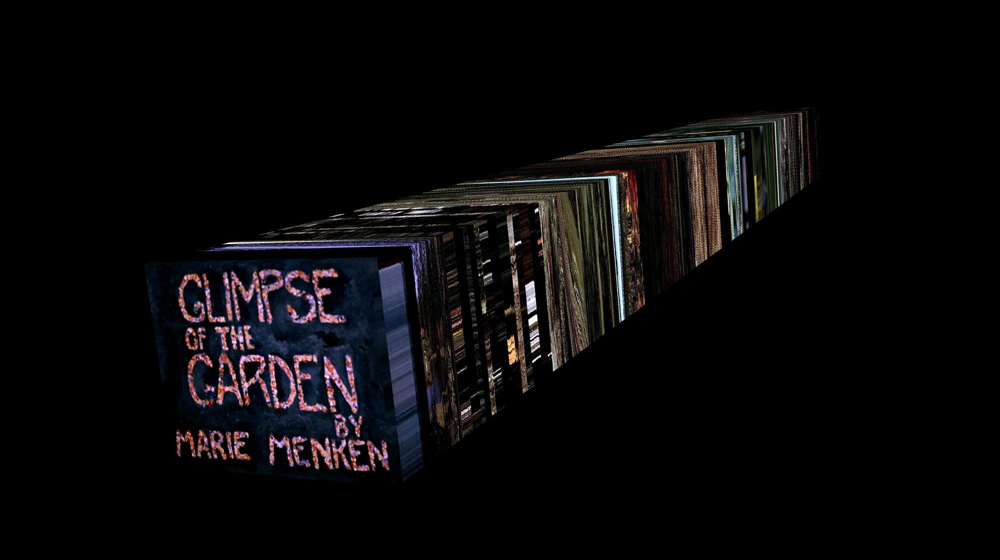
*Cuboid Void spatial projection. "Glimpse of a Garden" (1957) by Marie Menken.*

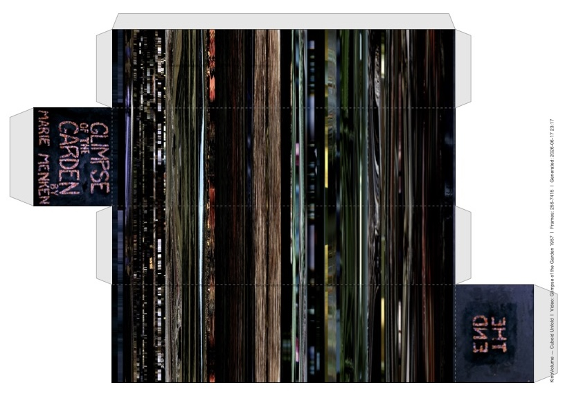
*Printable PDF unfold generated from the Cuboid Void mesh. "Glimpse of a Garden" (1957) by Marie Menken.*

Cuboid Void is the lighter workflow. It samples only the outer border of the chosen rectangle across time, producing six face textures.

Best for:

- fast iteration
- surface-based reconstructions
- mesh export and printable unfold workflows

Outputs:

- `front.png`, `back.png`, `top.png`, `bottom.png`, `left.png`, `right.png`
- `cuboid.glb` or `cuboid.obj`
- `cuboid_unfold.pdf`
- in-app 2D unfolded preview and 3D cuboid preview

#### Cuboid Fill

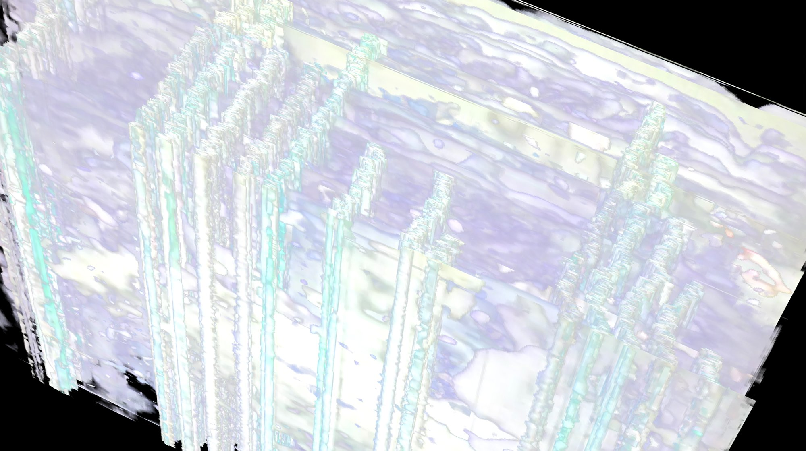
*Cuboid Fill spatial volume extracted using Chroma Key. "STREAMSSECTIONSECTIONSSECTIONED" (1971) by Paul Sharits.*

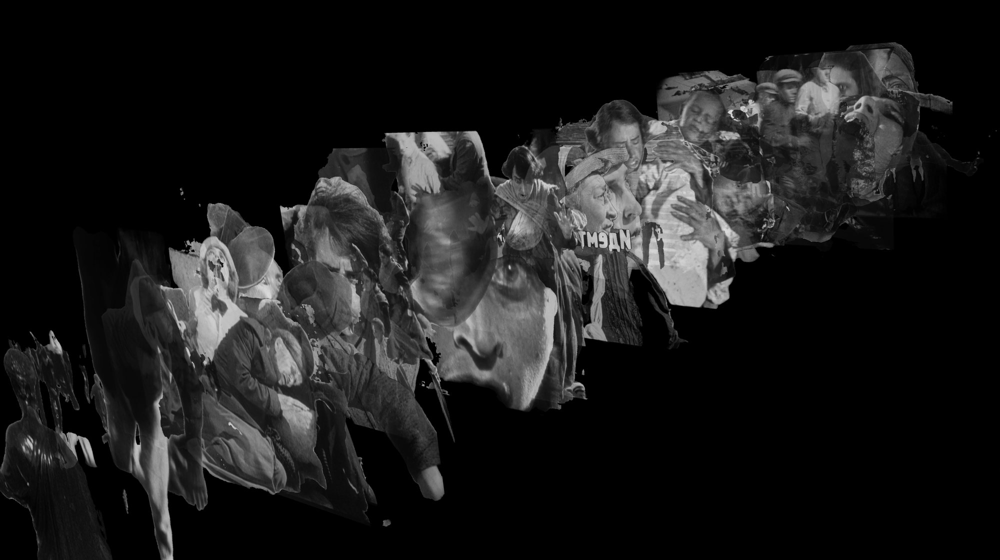
*Volumetric figure trails isolated via Fast AI segmentation. "Battleship Potemkin" (Бронено́сец Потёмкин, 1925) by Sergey Eisenstein.*

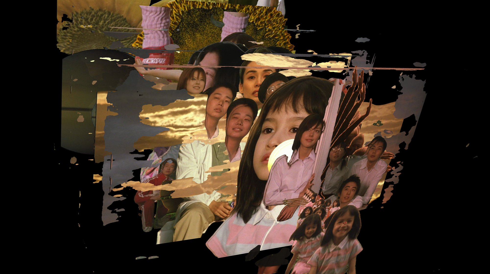
*Dense temporal accumulation obtained through high-precision AI segmentation. "The Taste of Tea" (茶の味, 2004) by Katsuhito Ishii.*

Cuboid Fill preserves the entire masked area for every sampled frame. Instead of saving only the outside faces, it saves a frame stack to disk for volumetric preview. It is very resource intensive, for efficiency make small samples and preview with fewer frames.

Best for:

- dense temporal volumes
- figure trails and interior accumulation
- chroma or extraction-based isolation of subjects

Outputs:

- `frames/frame_000000.png` and subsequent numbered frames
- in-app filled 3D preview

Important current behavior:

- Cuboid Fill does **not** currently export a mesh file in the main workflow.
- Cuboid Fill does **not** currently expose the printable unfold export.
- When transparency is needed, frame slices are saved as PNG so the alpha channel is preserved.

Extraction methods inside Cuboid Fill:

| Method | Relevant parameters | Use when |
| --- | --- | --- |
| None | No extra extraction parameters | You want the full masked image area as-is |
| Chroma Key | Color, Tolerance, Fade | You have a keyed background or controlled color field |
| Edge Detect | Canny Low, Canny High, Close gaps, Min area, Invert mask, Select object | You want a fast, dependency-light way to isolate contours or track subject movement |
| AI Segment | Model, Confidence, Invert mask, Select object, Download Model | You want higher-quality foreground extraction |

Practical guidance:

- Use **Preview Mask** before a full run when working with Edge Detect or AI Segment.
- Use **Select object** when the automatic mask finds too much foreground.
- Start with `u2netp` for AI segmentation unless you truly need the larger `u2net` model.

### Cylinder

Cylinder samples a circular perimeter in each frame and unwraps it into a textured cylindrical surface. The first and last sampled frames become the front and back caps.

Best for:

- simplest 3D figure to print

Main parameters:

| Parameter | What it changes | Notes |
| --- | --- | --- |
| Center X / Center Y | Center of the circular sample | Can be entered numerically or dragged in the preview |
| Radius | Size of the sampled circle | Larger radii produce denser textures and larger caps |
| 3D Preview | High, Medium, Low, Full, or No preview | Lower settings make interactive preview faster |

Outputs:

- `surface.png` or `surface.tiff`
- `cap_front.png`, `cap_back.png`
- `cylinder.glb` or `cylinder.obj`
- `cylinder_unfold.pdf`

### Rings

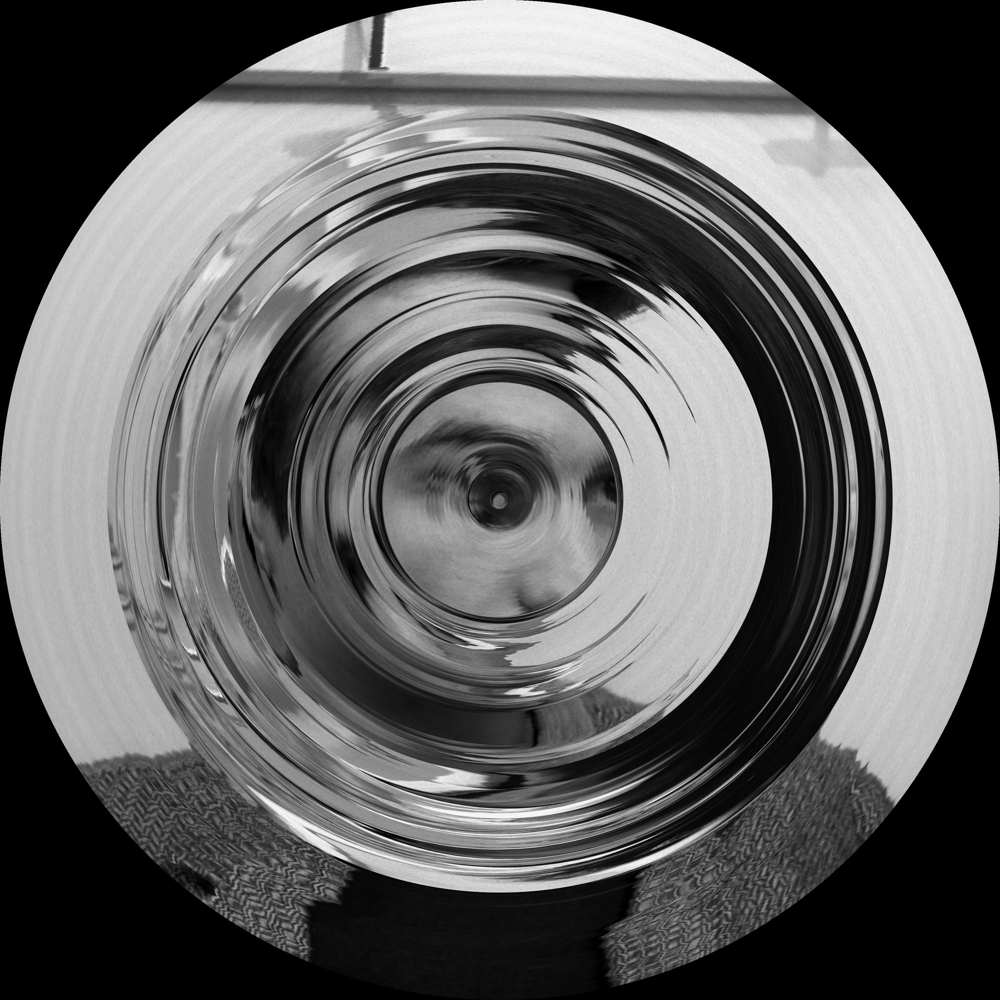
*Radial chronological projection (Rings mode) compressing the temporal duration of "Masculin Féminin" (1966) by Jean-Luc Godard.*

Rings turns the video into a dendrochronology-like image where each frame becomes a ring. The result can read as a compressed chronology, a growth pattern, or a circular archive.

Best for:

- cyclical or seasonal structures
- long-duration 2D summaries
- visualizing chronology as radial growth

Main parameters:

| Parameter | What it changes | Notes |
| --- | --- | --- |
| Center X / Center Y | Center of the ring system | Can be adjusted numerically or dragged |
| Sampling | `Fit to frame size`, `All frames (scaled)`, `Equal-area` | Each mode balances chronology, density, and radial spacing differently |
| Max Resolution | Maximum diameter in pixels | Strongly affects output size and memory use |
| Reverse time | Reverses chronology | Makes the last frame sit at the center instead of the first |

Outputs:

- `rings.png` or `rings.tiff`

Notes:

- `Fit to frame size` is conservative and avoids exceeding the available radius.
- `All frames (scaled)` keeps one ring per frame.
- `Equal-area` gives wider inner rings and thinner outer rings.

### Slice

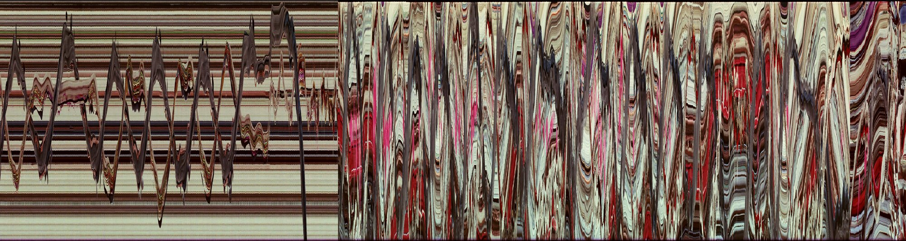
*Horizontal Slice representation mapping horizontal camera and subject motion.*

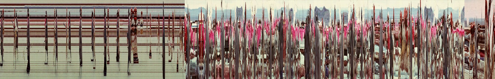
*Vertical Slice representation showcasing linear temporal structure through vertical sampling.*

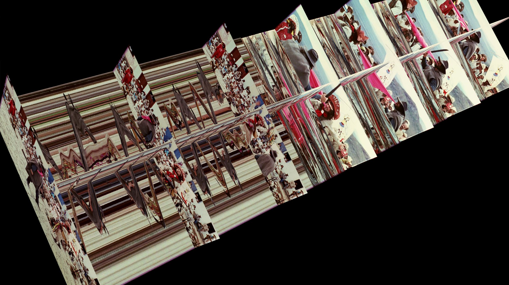
*Orthogonal Z Slice composite mapping planar crosses. Extracted from Glauber Rocha's "Antonio das Mortes (O Dragão da Maldade contra o Santo Guerreiro)" (1969).*

Slice extracts a narrow strip from each frame and concatenates those strips across time. It is useful for studying movement, edits, camera drift, or the temporal behavior of a specific line through the image.

Best for:

- efficient space-time analysis
- temporal compression into a 2D image (or 3D)
- comparing motion density across long durations
- Orthogonal slice the frames in synch with frames helps a lot to undestand what the visual signatures represent.

Main parameters:

| Parameter | What it changes | Notes |
| --- | --- | --- |
| Orientation | Vertical or Horizontal slit | Vertical grows left-to-right over time; Horizontal grows top-to-bottom |
| Slit Width | Width of the sampled strip in pixels | Larger values capture more context per frame and enlarge the output |
| Slit Position | Where the strip sits in the frame | Can be set numerically or dragged directly in the preview |
| Orthogonal | Enables a second perpendicular slit | Creates two intersecting slice images and a 3D cross-plane preview |
| Display Frames | Which full frames appear as extra planes in Orthogonal 3D view | Options: None, Central frame, Every N frames, N frames total, Specific frames |

Outputs:

- Standard Slice: `slice.png` or `slice.tiff`
- Orthogonal Slice: `slice_vertical.png`, `slice_horizontal.png`
- Orthogonal Slice mesh: `orthogonal.glb` or `orthogonal.obj`

Notes:

- Standard single-slit Slice is a 2D workflow.
- Orthogonal Slice adds a 3D representation of two crossing planes through the video volume.

### Slit-scan


*Slit-scan (Vertical Sweep) visualizing progressive spatial translation into temporal duration.*


*Alternate Slit-scan vertical sampling revealing architectural motion. Extracted from Peter Bo Rappmund's "Psychohydrography" (2010).*

Slit-scan samples a spatial-temporal cut plane through the video volume. It supports planar cuts (diagonal sweeping through the cube), all-frames sweeps, and oblique mode with four user-defined control points. In the later two the slit moves progressively through the frame.

Best for:

- planar sweeps through the video cube
- comparing spatial and temporal structure in one image
- good for extracting change in a single-shot
- oblique cuts across (x, y, t) space

Main parameters:

| Parameter | What it changes | Notes |
| --- | --- | --- |
| Mask Type | Vertical, Horizontal, or Oblique | Defines the axis and geometry of the scan |
| Sampling | Planar cut (3D), All frames, or Fit to frame size | Planar produces a true 3D-diagonal plane through the cube |
| Scan Direction | Direction of the sweep | L→R, R→L, T→B, B→T |
| Slit Width | Width of the sampled strip in pixels | Used in All frames and Fit to frame size modes |
| Mask Borders | Left/Right/Top/Bottom insets | Defines the active scan region |

Outputs:

- `slitscan_vertical.png` / `slitscan_horizontal.png` / `slitscan_oblique.png`
- `slitscan_planar.glb` or `slitscan_planar.obj` (planar mode only)

### Slit-tear

Slit-tear lets you draw one or more freeform lines on the frame and sample those paths through time. The result is a composite image whose vertical axis is built from the pixels under your drawn lines.

Best for:

- following irregular contours or bodies
- comparing multiple trajectories in one output
- drawing a custom temporal sampling path instead of using a straight slit

Main parameters:

| Parameter | What it changes | Notes |
| --- | --- | --- |
| Drawn Lines | The actual paths being sampled | Draw directly in the frame preview by clicking and dragging |
| Line Width | Width of the sampled band around each line | Wider values capture a thicker region around the path |
| Undo / Clear All | Line editing controls | `Ctrl+Z` also removes the last drawn line |

Outputs:

- `slittear.png` or `slittear.tiff`
- in-app 3D curtain-style preview

Important current behavior:

- The main workflow currently provides a 3D preview for Slit-tear, but it does **not** automatically write a mesh export file.
- Multiple lines are separated by gray separator rows in the 2D image.

## Export formats and previews

### Image formats

| Format | Good default use | Notes |
| --- | --- | --- |
| PNG | Most workflows | Compact, lossless, widely supported |
| TIFF | Print and archival contexts | Larger files, LZW compression in the app |

### 3D export formats

| Format | Strengths | Tradeoffs |
| --- | --- | --- |
| glTF / GLB | Single file, embedded textures, strong Blender interoperability | Usually the best default |
| OBJ (Wavefront) | Very widely supported | Separate material and texture references |

Current mesh-export coverage in the main workflow:

- Cuboid Void: yes
- Orthogonal Slice: yes
- Cylinder: yes
- Slit-scan planar: yes
- Cuboid Fill: output is provided but not compatible with extraction
- Slit-tear: yes
- Rings: -

### Printable PDF export

Printable unfold export is available for face-based outputs:

- Cuboid Void -> `cuboid_unfold.pdf`
- Cylinder -> `cylinder_unfold.pdf`

PDF options:

| Parameter | Options | Notes |
| --- | --- | --- |
| Paper size | A4, A3, Letter, Legal, Tabloid | Useful for different print workflows |
| Scale | Fit, Stretch | `Fit` keeps proportions; `Stretch` lets the temporal axis fill more of the page |

### In-app preview modes

| Preview | What you see |
| --- | --- |
| Mask Selection | Current frame, overlay, and frame scrubber |
| 2D Preview | The generated image or unfolded face layout |
| 3D Preview | The generated object or spatial reconstruction |

After a generation, the app automatically switches to the most relevant result preview for that mode.

## Output folder structure

By default, the app saves into a timestamped subfolder inside your selected output directory:

```text
output_directory/
  video_mode_YYYYMMDD_HHMMSS/
    ...generated files...
```

Typical examples:

| Mode | Main files |
| --- | --- |
| Slice | `slice.png` |
| Orthogonal Slice | `slice_vertical.png`, `slice_horizontal.png`, `orthogonal.glb` or `orthogonal.obj` |
| Cuboid Void | six face images, `cuboid.glb` or `cuboid.obj`, optional `cuboid_unfold.pdf` |
| Cuboid Fill | `frames/` directory with numbered slices |
| Cylinder | `surface.png`, cap images, `cylinder.glb` or `cylinder.obj`, optional `cylinder_unfold.pdf` |
| Rings | `rings.png` |
| Slit-scan | `slitscan_vertical.png` / `slitscan_horizontal.png` / `slitscan_oblique.png`, optional `slitscan_planar.glb` |
| Slit-tear | `slittear.png` |

## Performance and memory guidance

KinoVolume can process very large amounts of image data. The most important factors are frame count, video resolution, mask size, and whether you are saving surfaces or full frame stacks.

### High-cost situations and how to control them

| Situation | What becomes expensive | Built-in controls | Recommended strategy |
| --- | --- | --- | --- |
| Long frame ranges at sampling rate `1` | More decoding, more pixels, larger outputs | Frame range, Sampling rate, Prev/Next Cut helpers | Start with a short range or a higher sampling step, then refine |
| Cuboid Fill with a large mask | Disk usage can become very large | Fill-mode estimate label, 3D preview checkbox, mask borders | Narrow the mask, shorten the frame range, or use Void if surface data is enough |
| AI segmentation on CPU | Inference can become slow, especially on long clips | `u2netp` fast model, Preview Mask, Select object | Test on a short range first and use Edge Detect if it is sufficient |
| Orthogonal Slice with many display frames | More files and heavier 3D view | Display Frames options | Start with `Central frame` and only add more planes if needed |
| Cylinder with large radius and high preview quality | Denser textures and slower interaction | 3D Preview quality | Use Medium, Low, or No preview while exploring settings |
| Rings with a very high Max Resolution | Large square image files | Max Resolution | Keep it only as high as your print or screen output requires |
| Slit-scan with a high sampling mode | Large output images | Sampling mode, mask borders | Use Fit to frame size for lighter outputs |
| Slit-tear with many long lines or wide line width | Taller output images and heavier previews | Line Width, Undo, Clear All | Keep the line set focused and increase width only when conceptually needed |

### Automatic warnings already in the app

- Large Slice and Cuboid runs can trigger a high-memory warning dialog.
- Cuboid Fill shows an estimated disk-usage label before generation.

### Important practical advice

- If you are exploring, do a short test export first.
- If you only need the outer surface of a cuboid, prefer **Void** over **Fill**.
- Disable or lower previews when your goal is export, not real-time inspection.
- Keep output directories on a drive with plenty of free space.

## Technical notes for advanced users and agents

This repository is organized as a desktop research application rather than a Python package library.

Key implementation facts:

- The UI is built with PySide6.
- Video decoding is handled through OpenCV in `models/video_source.py`.
- Each major processing mode runs in its own `QThread` subclass under `processing/`.
- Slice uses memory-mapped arrays so long outputs do not require a fully in-memory image build.
- Cuboid Void pre-allocates only the needed face textures.
- Cuboid Fill writes each masked frame to disk immediately instead of building a full volume in RAM.
- Slit-tear also uses a disk-backed intermediate workflow (`_strips_tmp/`) before assembling the final image.
- Rings uses a vectorized polar look-up-table approach rather than per-pixel Python loops.
- OBJ writing is handled manually in `export/mesh_exporter.py`; GLB export uses trimesh.
- Printable unfold export is handled in `export/unfold_exporter.py` through ReportLab.
- 3D preview widgets are lazy-loaded, and preview textures are capped for responsiveness.
- AI segmentation models are cached under `~/.cache/kinovolume/models/` unless bundled with the application.

Useful source locations:

- [Development Manual](Development%20Manual)
- [main.py](main.py)
- [config.py](config.py)
- [models/](models)
- [processing/](processing)
- [export/](export)
- [ui/](ui)
- [tests/](tests)

High-level folder map:

```text
deep_vid_visualizer/
  main.py
  config.py
  models/
  processing/
  export/
  ui/
  resources/
  tests/
```

## Citation

If you use this software in a research project, publication, artwork, or teaching context, please cite the software record in [CITATION.cff](CITATION.cff).

Suggested software citation:

```text
Isaza-Giraldo, A. (2026). KinoVolume (Version 0.1.0) [Computer software]. i2ADS. https://isaza.xyz
```

## License

This repository is released under the GNU General Public License v3.0. See [LICENSE](LICENSE).

GPL is a good fit for this project because it keeps the software open and requires redistributed modified versions to remain under the same license.

Like most GPL software, KinoVolume is distributed without warranty. Third-party dependencies keep their own licenses.

## Current limitations

- Full shot-detection batch generation is not complete yet.
- The frame scrubber does include previous/next hard-cut search, but there is no finished scene-list workflow for batch exports.
- Cuboid Fill and Slit-tear currently provide in-app 3D previews without automatic mesh export in the main generation pipeline.
- AI segmentation depends on ONNX Runtime and downloaded model files.
- Signed distribution requires a valid Apple Developer identity and notarization credentials on the build machine.

## Development and verification

The project includes automated tests under [tests/](tests). If you are extending the software rather than using it as an end-user tool, start with the [Development Manual](Development%20Manual) and then inspect the processors and previews for the mode you want to modify.
